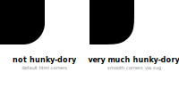

# Better rounded corners
*for HTML divs in React.js*

`react-round-div` makes your rounded rectangles look smoother for a more pleasant feel. With a simple and easy integration into your code you have to do almost nothing to up the style of your project.

Here is a very clear demonstration of these smooth corners:



## Installation

```shell
npm i react-round-div
```

## Usage
Simply import the package and replace any divs with rounded corners (`border-radius`) that you want to improve. `react-round-div` will handle the rest.  
```jsx  
import RoundDiv from 'react-round-div';

const App = () => {
    return (
        <RoundDiv>
            <p>Hello smooth corners!</p>
        </RoundDiv>
    )
};

export default App;
```


## Caveats
This package is still in the starting blocks, so for now borders are only supported in the `solid` style and some transitions on the div may not work properly.

Moreover, children inside `RoundDiv` get cut off when are placed (partly) outside the div due to `clip-path` being used to make the smooth corners. There will probably an option in later versions to use a pseudo-element for the shape, so that children can be rendered outside.
